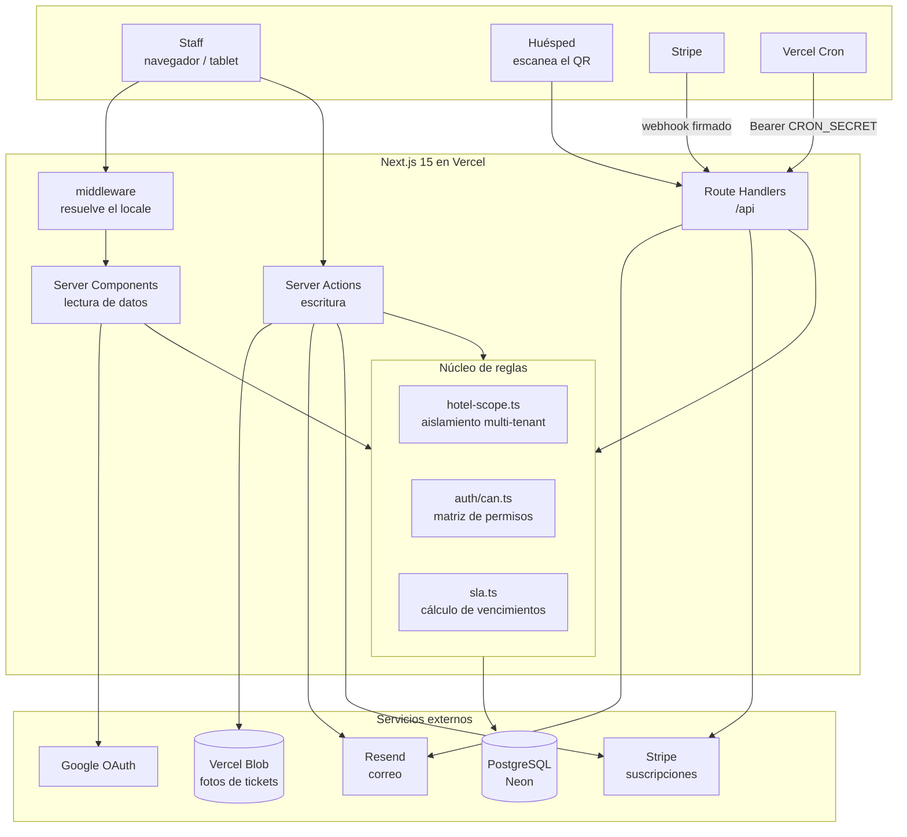

# Arquitectura

Todo el sistema es **una sola aplicación de Next.js** desplegada en Vercel.
Frontend y backend viven en el mismo repositorio y el mismo deploy: no hay una
API REST separada porque no hay un segundo consumidor que la justifique.

## Piezas

## Por dónde entra cada quien

| Quien | Camino | Autenticación |
|---|---|---|
| Staff | Server Components y Server Actions | Sesión de NextAuth |
| Huésped | Server Action pública en `/qr/{slug}` | Ninguna: rate-limiting por origen |
| Stripe | `POST /api/webhooks/stripe` | Firma sobre el cuerpo crudo |
| Vercel Cron | `GET /api/cron/*` | `Authorization: Bearer $CRON_SECRET` |

## El núcleo de reglas

Tres archivos concentran lo que, mal hecho, causaría los peores fallos:

**`lib/hotel-scope.ts`** — el aislamiento multi-tenant. Toda consulta escopada
pasa por aquí; ninguna acción arma su filtro de `hotelId` a mano. El error a
evitar no es solo mezclar hoteles de un cliente, sino filtrar datos entre
empresas distintas.

**`lib/auth/can.ts`** — la matriz de permisos completa, incluida la lógica del
permiso otorgable de borrado. Los componentes reciben banderas ya resueltas; no
leen `corporateRole` ni `permissionLevel` por su cuenta.

**`lib/sla.ts`** — el cálculo de vencimiento y su detección. Una sola fórmula,
usada igual por el tablero, las métricas y la exportación.

## Decisiones de flujo que vale la pena señalar

**La sesión guarda solo el id.** Rol, organización y hoteles accesibles se leen
frescos de la base en cada request. Cuesta una consulta, pero revocar un permiso
surte efecto de inmediato en vez de esperar a que expire un JWT.

**Los filtros viven en la URL, no en estado local.** Así la vista es compartible
y la exportación a Excel reutiliza exactamente los mismos filtros que el usuario
tiene en pantalla, sin un formulario de reporte aparte.

**Los enums se guardan en inglés neutral.** La traducción existe solo en los
archivos de mensajes. Agregar un idioma es crear un JSON y registrar el locale.

**Las fotos van a Blob, no a la base.** En `TicketAttachment` solo se guarda la
URL. El tipo se valida contra el MIME real del archivo, no contra su extensión.

## Cron en el plan Hobby de Vercel

Hobby permite **una corrida diaria por job**, no una por hora. Los tres jobs se
ajustaron a esa cadencia y ninguno pierde su propósito:

| Job | Horario | Por qué alcanza |
|---|---|---|
| `recurring-tickets` | 06:00 | La frecuencia mínima de una plantilla ya es diaria |
| `expire-trials` | 07:00 | Un vencimiento de prueba no necesita precisión de minutos |
| `trial-reminders` | 08:00 | El aviso es de días, no de horas |

`recurring-tickets` es idempotente: `nextRunAt` avanza en la misma transacción
que crea el ticket. Y si el cron no corre durante una semana, una plantilla
diaria genera **un** ticket y reanuda el ciclo — no siete atrasados de golpe.

## Degradación sin credenciales

El proyecto arranca y es usable sin ninguna llave externa, lo que importa para
que un reclutador pueda clonarlo y correrlo:

| Falta | Qué pasa |
|---|---|
| `AUTH_GOOGLE_*` | El provider de Google no se registra; queda correo y contraseña |
| `RESEND_API_KEY` | Los correos se imprimen en consola con su link |
| `STRIPE_*` | La pantalla de facturación dice que Stripe no está configurado |
| `BLOB_READ_WRITE_TOKEN` | La tarjeta de fotos lo indica en vez de fallar al subir |
| `CRON_SECRET` | Los endpoints de cron rechazan todo — abierto sería peor |
