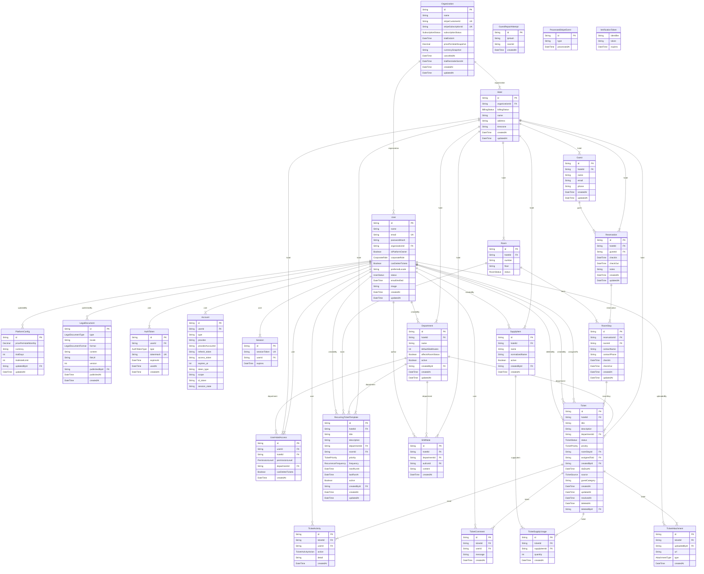

# Modelo de datos

> Generado desde `prisma/schema.prisma` con `npm run docs:erd`. No editar a mano.

Multi-tenancy row-level: `Organization` es el límite de aislamiento principal y `Hotel` el segundo. Casi toda entidad operativa lleva `hotelId` para que el scoping sea un filtro directo y no una inferencia por relaciones.

## Diagrama

## Entidades

| Modelo | Tabla | Para qué existe |
|---|---|---|
| `Organization` | `organizations` | — |
| `PlatformConfig` | `platform_config` | — |
| `LegalDocument` | `legal_documents` | — |
| `GuestReportAttempt` | `guest_report_attempts` | — |
| `ProcessedStripeEvent` | `processed_stripe_events` | — |
| `Hotel` | `hotels` | — |
| `User` | `users` | — |
| `UserHotelAccess` | `user_hotel_access` | — |
| `AuthToken` | `auth_tokens` | — |
| `Account` | `accounts` | — |
| `Session` | `sessions` | — |
| `VerificationToken` | `verification_tokens` | — |
| `Department` | `departments` | — |
| `SupplyItem` | `supply_items` | — |
| `Guest` | `guests` | — |
| `Reservation` | `reservations` | — |
| `Room` | `room` | — |
| `RoomStay` | `room_stays` | — |
| `Ticket` | `tickets` | — |
| `TicketActivity` | `ticket_activities` | — |
| `TicketComment` | `ticket_comments` | — |
| `TicketAttachment` | `ticket_attachments` | — |
| `TicketSupplyUsage` | `ticket_supply_usage` | — |
| `RecurringTicketTemplate` | `recurring_ticket_templates` | — |
| `ShiftNote` | `shift_notes` | — |

## Enums

Todos los enums usan códigos neutrales en inglés. La traducción vive solo en los archivos de mensajes de next-intl: agregar un idioma nunca obliga a traducir lo ya almacenado.

| Enum | Valores |
|---|---|
| `SubscriptionStatus` | `TRIALING`, `ACTIVE`, `PAST_DUE`, `CANCELLED`, `EXPIRED` |
| `BillingStatus` | `ACTIVE`, `SUSPENDED` |
| `CorporateRole` | `NONE`, `CORPORATE_ADMIN`, `SUPERADMIN` |
| `UserStatus` | `INVITED`, `ACTIVE`, `DISABLED` |
| `PermissionLevel` | `STAFF`, `ADMIN` |
| `AuthTokenType` | `INVITE`, `PASSWORD_RESET` |
| `LegalDocumentType` | `TERMS`, `PRIVACY` |
| `LegalDocumentFormat` | `TEXT`, `PDF` |
| `RoomStatus` | `AVAILABLE`, `OCCUPIED`, `MAINTENANCE` |
| `TicketStatus` | `PENDING`, `IN_PROGRESS`, `RESOLVED`, `CANCELLED` |
| `TicketPriority` | `LOW`, `MEDIUM`, `HIGH` |
| `TicketSource` | `STAFF`, `GUEST` |
| `TicketActivityAction` | `CREATED`, `REASSIGNED`, `STATUS_CHANGED`, `COMMENTED`, `ATTACHED`, `DELETED` |
| `AttachmentType` | `BEFORE`, `AFTER`, `OTHER` |
| `RecurrenceFrequency` | `DAILY`, `WEEKLY`, `MONTHLY` |
